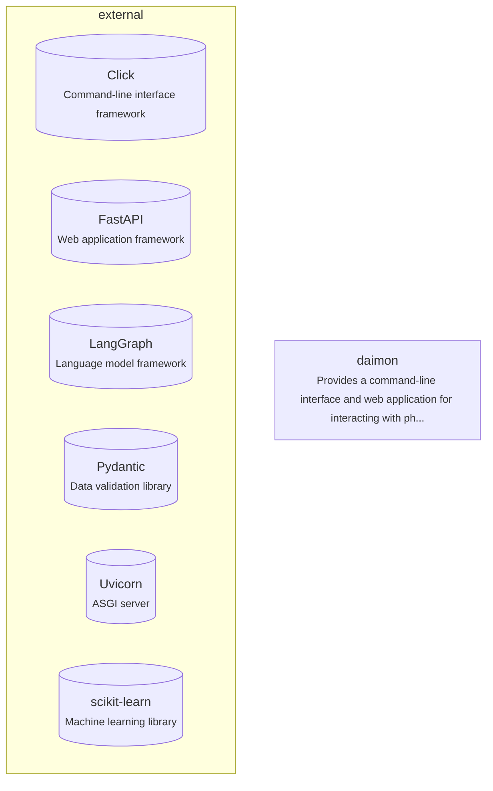

# Architecture
This is the architecture of the daimon codebase.

## Components
### daimon
The daimon component provides various functionalities, including a service worker endpoint [src/daimon/api.py:280-285], a command-line interface [src/daimon/cli.py:1-300], and a web application with features such as creating timeline items [src/daimon/web/app.js:745-783] and sending POST requests to the `/api/salon` endpoint [src/daimon/web/salon.js:143-187]. The key files for this component include `src/daimon/cli.py`, `src/daimon/rag/ingest.py`, `src/daimon/delivery/daily.py`, `src/daimon/api.py`, `src/daimon/web/salon.js`, and `src/daimon/web/app.js`. The daimon component also involves the use of `session_id`, `GenerateRequest`, `ReplyRequest`, `SalonRequest`, `MeRequest`, `BookmarkRequest`, and `PrefsRequest`.

## Data Flow
The data flow in the daimon component involves the `service_worker` function returning a `FileResponse` with a service worker script [src/daimon/api.py:280-285]. The `submit` function in the web application sends a `POST` request to the `/api/salon` endpoint with a question and selected philosophers [src/daimon/web/salon.js:143-187]. The `makeTimelineItem` function creates a timeline item for a letter in the web application [src/daimon/web/app.js:745-783]. The `cli` module provides various commands for interacting with the application, including generating letters and mining correspondence [src/daimon/cli.py:1-300]. The backend of the application is responsible for handling requests and connecting to the database using `connect` and `init_db`.

## External Dependencies
* Click: Command-line interface framework
* FastAPI: Web application framework
* LangGraph: Language model framework
* Pydantic: Data validation library
* Uvicorn: ASGI server
* scikit-learn: Machine learning library

## Runtime Topology
The daimon codebase is deployed as a hybrid application, utilizing both command-line interface and web application components [src/daimon/api.py:280-285] [src/daimon/web/salon.js:143-187] [src/daimon/web/app.js:745-783] [src/daimon/cli.py:1-300].
